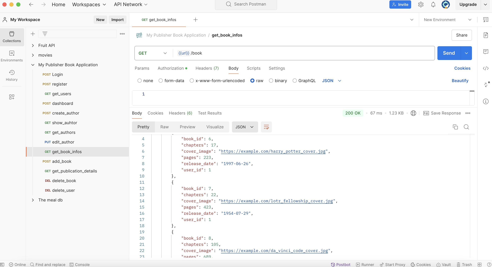

<a id="top"></a>

<!-- PROJECT SHIELDS -->
[![Contributors][contributors-shield]][contributors-url]
[![Forks][forks-shield]][forks-url]
[![Stargazers][stars-shield]][stars-url]
[![Issues][issues-shield]][issues-url]
[![MIT License][license-shield]][license-url]
[![LinkedIn][linkedin-shield]][linkedin-url]

<!-- PROJECT LOGO -->
<br />
<div align="center">
    
  </a>

  <h3 align="center">Publisher Book App</h3>
  <p align="center">
    An application to manage and view authors' books and publication details.
    <br />
    <a href="https://github.com/Welat-E/Book-Publisher-App"><strong>Explore the docs »</strong></a>
    <br />
    <br />
    <a href="https://github.com/Welat-E/Book-Publisher-App">View Demo</a>
    ·
    <a href="https://github.com/Welat-E/Book-Publisher-App/issues">Report Bug</a>
    ·
    <a href="https://github.com/Welat-E/Book-Publisher-App/issues">Request Feature</a>
  </p>
</div>

<!-- TABLE OF CONTENTS -->
<details>
  <summary>Table of Contents</summary>
  <ol>
    <li><a href="#about-the-project">About The Project</a></li>
    <li><a href="#getting-started">Getting Started</a></li>
    <li><a href="#usage">Usage</a></li>
    <li><a href="#roadmap">Roadmap</a></li>
    <li><a href="#contributing">Contributing</a></li>
    <li><a href="#license">License</a></li>
    <li><a href="#contact">Contact</a></li>
    <li><a href="#acknowledgments">Acknowledgments</a></li>
  </ol>
</details>

## About The Project

<br />
<div align="center">
  
</div>
<br />
A web service designed for publishers to manage authors and their books. Each book entry includes details such as pages, chapters, release date, and more. Additionally, publishers can track publication-specific information, including price.

### Built With

This section lists the major frameworks and libraries used in the project.

* [![Flask][Flask-img]][Flask-url]
* [![SQLAlchemy][SQLAlchemy-img]][SQLAlchemy-url]
* [![Swagger][Swagger-img]][Swagger-url]
* [![PostgreSQL][PostgreSQL-img]][PostgreSQL-url]

<!-- ICON LINKS -->

[Flask-img]: https://img.shields.io/badge/Flask-000000?style=for-the-badge&logo=flask&logoColor=white
[Flask-url]: https://flask.palletsprojects.com/

[SQLAlchemy-img]: https://img.shields.io/badge/SQLAlchemy-323232?style=for-the-badge&logo=databricks&logoColor=white
[SQLAlchemy-url]: https://www.sqlalchemy.org/

[Swagger-img]: https://img.shields.io/badge/Swagger-85EA2D?style=for-the-badge&logo=swagger&logoColor=black
[Swagger-url]: https://swagger.io/

[PostgreSQL-img]: https://img.shields.io/badge/PostgreSQL-336791?style=for-the-badge&logo=postgresql&logoColor=white
[PostgreSQL-url]: https://www.postgresql.org/

<p align="right">(<a href="#top">back to top</a>)</p>

<!-- GETTING STARTED -->
## Getting Started

### Prerequisites
* Python 3.12.3
* Install required packages:
  
    ```bash
    pip install -r requirements.txt
    ```

* Set up a PostgreSQL database and configure `.env` file with your credentials.

### Installation

1. Clone the repo
    
    ```bash
    git clone https://github.com/Welat-E/Book-Publisher-App.git
    ```
    
2. Install dependencies
    
    ```bash
    pip install -r requirements.txt
    ```
    
3. Set environment variables in the `.env` file.
4. Run the application
    
    ```bash
    flask run
    ```

<p align="right">(<a href="#top">back to top</a>)</p>

<!-- USAGE EXAMPLES -->
## Usage

To explore the API documentation, navigate to `/apidocs` after starting the Flask server.

<div align="center">
    
  </a>
</div>

## Roadmap

* [ ] Add more comprehensive API tests
* [ ] Enhance the frontend with better UI/UX
* [ ] Implement additional filters for book searches

## Contributing

1. Fork the Project
2. Create your Feature Branch (`git checkout -b feature/AmazingFeature`)
3. Commit your Changes (`git commit -m 'Add some AmazingFeature'`)
4. Push to the Branch (`git push origin feature/AmazingFeature`)
5. Open a Pull Request

<p align="right">(<a href="#top">back to top</a>)</p>

## License

Distributed under the MIT License. See `LICENSE` for more information.

## Contact

Welat - welaterenug@gmail.com

Project Link: [https://book-publisher-app.onrender.com/apidocs/](https://book-publisher-app.onrender.com/apidocs/)

<!-- ICON LINKS -->
<!-- MARKDOWN LINKS & IMAGES -->
[contributors-shield]: https://img.shields.io/github/contributors/Welat-E/Book-Publisher-App.svg?style=for-the-badge
[contributors-url]: https://github.com/Welat-E/Book-Publisher-App/graphs/contributors
[forks-shield]: https://img.shields.io/github/forks/Welat-E/Book-Publisher-App.svg?style=for-the-badge
[forks-url]: https://github.com/Welat-E/Book-Publisher-App/network/members
[stars-shield]: https://img.shields.io/github/stars/Welat-E/Book-Publisher-App.svg?style=for-the-badge
[stars-url]: https://github.com/Welat-E/Book-Publisher-App/stargazers
[issues-shield]: https://img.shields.io/github/issues/Welat-E/Book-Publisher-App.svg?style=for-the-badge
[issues-url]: https://github.com/Welat-E/Book-Publisher-App/issues
[license-shield]: https://img.shields.io/badge/License-MIT-blue.svg?style=for-the-badge
[license-url]: https://github.com/Welat-E/Book-Publisher-App/blob/main/LICENSE.txt
[linkedin-shield]: https://img.shields.io/badge/-LinkedIn-black.svg?style=for-the-badge&logo=linkedin&colorB=555
[linkedin-url]: https://www.linkedin.com/in/welateren/
